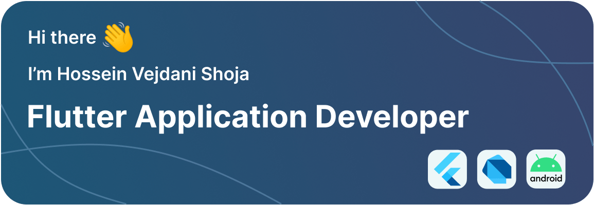

## About Me 
Experienced Mobile App Developer with over 3 years of expertise in designing, developing, testing, and maintaining cutting-edge applications using **Flutter** and **Dart**. Adept at debugging, troubleshooting, and seamlessly integrating third-party libraries and APIs. Proficient in state management, app architecture, and working with remote development environments.Demonstrated competence in constructing RESTful APIs utilizing **FastAPI**, **Python**, and **MongoDB**. 

Successfully launched three mobile apps, two of which were published on Iranian app markets, amassing 4000+ active users.

Equipped with a collaborative spirit and a good adaptability to new environments, consistently thriving in team settings. Eager to Learn new technologies and strong ability in providing innovative and creative solutions to overcome complex problems and challenges.

Want to know more about me? Check out my linkedin profile.

 

## 💼 Skills

 

## ✅ Experiences and Projects

**Full-Stack Mobile App Developer**

May 2019 - Present

Esfahan, IranEsfahan, Iran

#### Projects:
- Darito App: An expense tracking Android app that has been successfully published on two Iranian app marketplaces with over 4,000 downloads in under 12 months.
- Haazerr App: A stuff commute management android app in Persian that successfully developed. It will publish after testing.
- Word Cleaner: An Android app that helps filter and categorize Persian words. Over 230,000 words were reviewed in under 4 months, with an average processing time of 2 seconds per word.
- BiTa Kiosk App: Two embedded Linux app with a beautiful UI that connects to a sensor device via a serial port at 60 Hz.

#### Responsibilities:
- Developed and delivered 4 mobile and Linux software using Flutter, Dart, Figma, Python, FastAPI, and MongoDB.
- Implemented RESTful APIs and integrated third-party libraries to improve application functionality.
- Debugged and troubleshot mobile apps and resolved issues related to the app with a resolution time of 2 days per issue, typically.
- Built RESTful APIs using FastAPI, Python, and MongoDB in all projects with a development time of 2 weeks per project, typically.
- Participated in code review and testing for all applications with an typical review and testing time of 1 week per project.
- Researched about new technologies and development environments.

#### Achievements:
- Delivered 4 successful apps for mobile and Linux platforms with an average development time of 3 months per project.
- Launched 2 Android applications on Iranian app marketplaces with 2,500 active users and a total rating of 4.6.
- Made codes more testable, scalable, and maintainable by using proper coding architectures in all projects.
- Contributed to a positive team atmosphere and fostered collaboration and knowledge sharing among team members.
- Achieved customer satisfaction and received positive feedback for communication and problem-solving skills with a satisfaction rate of 95%. 

  
## 📌 My Gitgub Stats

 

 

